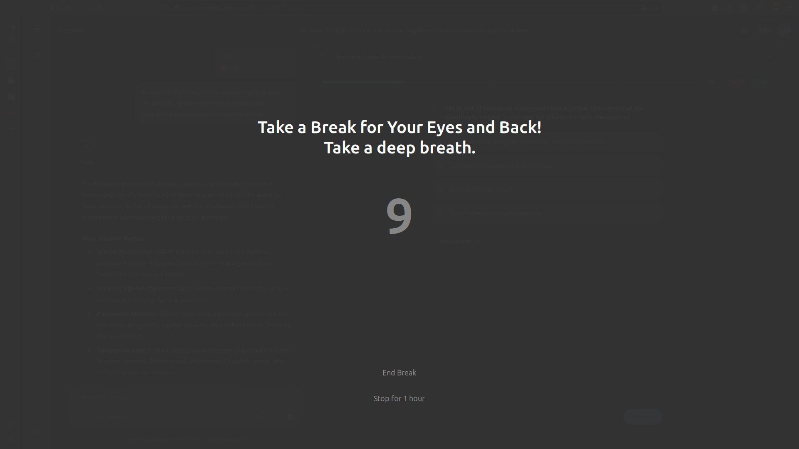

# Break Reminder GNOME Extension

A GNOME Shell extension that reminds you to take breaks for your eyes and back every 20 minutes.

## Screenshot



## Features

- Automatic break reminders every 20 minutes (configurable)
- Helps prevent eye strain and back pain
- 20-second countdown timer
- Configurable settings
- Clean, minimal modal dialog interface

## Requirements

- GNOME Shell 45 or later
- Python 3.x
- GTK4 (python3-gi)

Most Ubuntu/Fedora GNOME users already have these installed. If not:

```bash
# Ubuntu/Debian
sudo apt install python3 python3-gi gir1.2-gtk-4.0

# Fedora
sudo dnf install python3 python3-gobject gtk4
```

## Installation

### Manual Installation

1. Clone this repository:

```bash
git clone https://github.com/AhmetNA/Break_Reminder.git
cd Break_Reminder
```

2. Copy the extension to your GNOME extensions directory:

```bash
cp -r break-reminder@ahmet.com ~/.local/share/gnome-shell/extensions/
```

3. Compile the settings schema:

```bash
cd ~/.local/share/gnome-shell/extensions/break-reminder@ahmet.com
glib-compile-schemas schemas/
```

4. Restart GNOME Shell:

   - On X11: Press `Alt+F2`, type `r`, and press Enter
   - On Wayland: Log out and log back in

5. Enable the extension:

```bash
gnome-extensions enable break-reminder@ahmet.com
```

## Configuration

Open Settings → Extensions → Break Reminder to configure:

- **Break Interval**: Minutes between break reminders (5-120 minutes)
- **Break Duration**: Seconds to display break reminder (5-60 seconds)

## Usage

Once enabled, the extension runs automatically. Every 20 minutes a modal dialog appears with a countdown timer. You can click "End Break" to dismiss early or wait for the timer to finish.

## Development

To view extension logs:

```bash
journalctl -f -o cat /usr/bin/gnome-shell
```

## File Structure

```
break-reminder@ahmet.com/
├── extension.js          # Main extension logic (timer)
├── break_screen.py       # Python GTK4 fullscreen UI
├── metadata.json         # Extension metadata
├── prefs.js             # Settings UI
├── stylesheet.css       # Styling
└── schemas/             # Settings schema
    └── org.gnome.shell.extensions.break-reminder.gschema.xml
```

## License

Open source - feel free to use and modify.

## Troubleshooting

### Extension not showing up

```bash
gnome-extensions list
journalctl -f -o cat /usr/bin/gnome-shell
```

### Settings schema not found

```bash
cd ~/.local/share/gnome-shell/extensions/break-reminder@ahmet.com
glib-compile-schemas schemas/
```
